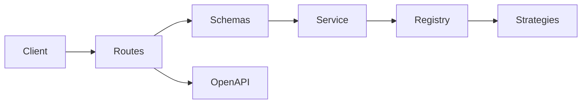

# Python Calculation API — Code Design & Best Practices

A production-oriented Flask REST API for mathematical and descriptive statistical
calculations. The project demonstrates application factories, modular blueprints,
schema validation, a strategy-based domain layer, standardized errors, automated
OpenAPI documentation, tests, Docker and continuous integration.

## Why this project exists

The original repository exposed a single arithmetic-mean endpoint. This version
keeps that concept and expands it into a small but complete API whose main purpose
is to demonstrate maintainable Python backend design rather than database CRUD.

## Features

- Arithmetic mean using `math.fsum` for numerically stable summation
- Median for odd and even input collections
- Weighted mean with cross-field validation
- Population or sample statistical summary
- Strict request schemas and rejection of unknown fields
- Maximum input size of 1,000 finite numbers per request
- Consistent JSON problem responses
- Request correlation through `X-Request-ID`
- Swagger UI and OpenAPI 3 documentation
- Unit and integration tests with a 90% coverage gate
- Docker image running as a non-root user
- GitHub Actions for Python 3.12 and 3.13
- Visual Studio Code debug, test and task configuration

## Architecture

```text
app/
├── calculations/          # HTTP schemas, routes and application service
│   ├── routes.py
│   ├── schemas.py
│   └── service.py
├── domain/                # Framework-independent calculation rules
│   ├── exceptions.py
│   └── strategies.py
├── health/                # Liveness endpoint
├── config.py
├── errors.py
├── extensions.py
└── __init__.py            # Application factory and middleware
```



The route layer handles HTTP concerns. Marshmallow schemas deserialize and validate
requests. `CalculationService` coordinates use cases. Domain strategies contain the
calculation rules and can be extended without changing route code.

## Endpoints

| Method | Endpoint | Description |
|---|---|---|
| `GET` | `/` | Service metadata and links |
| `GET` | `/health` | Liveness check |
| `GET` | `/openapi.json` | OpenAPI document |
| `GET` | `/docs` | Swagger UI |
| `GET` | `/api/v1/calculations/operations` | Operation catalog |
| `POST` | `/api/v1/calculations/arithmetic-mean` | Arithmetic mean |
| `POST` | `/api/v1/calculations/median` | Median |
| `POST` | `/api/v1/calculations/weighted-mean` | Weighted mean |
| `POST` | `/api/v1/calculations/statistics` | Statistical summary |

## Example

Request:

```http
POST /api/v1/calculations/weighted-mean
Content-Type: application/json

{
  "values": [7, 8, 10],
  "weights": [2, 3, 5]
}
```

Response:

```json
{
  "operation": "weighted_mean",
  "result": 8.8,
  "count": 3
}
```

Validation error:

```json
{
  "error": {
    "code": "validation_error",
    "message": "The request payload is invalid.",
    "request_id": "4b772bce26f04b2fb81bead739ea7021",
    "details": {
      "json": {
        "weights": ["Values and weights must have the same length."]
      }
    }
  }
}
```

## Local installation

Python 3.12 or 3.13 is recommended.

### Windows PowerShell

```powershell
py -3.12 -m venv .venv
Set-ExecutionPolicy -Scope Process -ExecutionPolicy Bypass
.\.venv\Scripts\Activate.ps1
python -m pip install --upgrade pip setuptools wheel
python -m pip install -r requirements-dev.txt
Copy-Item .env.example .env
python run.py
```

### Linux or macOS

```bash
python3 -m venv .venv
source .venv/bin/activate
python -m pip install --upgrade pip setuptools wheel
python -m pip install -r requirements-dev.txt
cp .env.example .env
python run.py
```

Open `http://127.0.0.1:5000/docs`.

## Tests and quality checks

```bash
python -m pytest
python -m ruff check .
python -m ruff format --check .
```

Apply safe automatic corrections:

```bash
python -m ruff check . --fix
python -m ruff format .
```

## Visual Studio Code

1. Open the project with `code .`.
2. Select `.venv` using **Python: Select Interpreter**.
3. Press `F5` and select **Flask API: debug**.
4. Use the Testing panel to run the Pytest suite.

## Docker

```bash
docker compose up --build
```

The API will be available at `http://localhost:5000`.

## Adding a new calculation strategy

1. Create a class derived from `CalculationStrategy`.
2. Provide an `OperationDescription`.
3. Implement `calculate(values)`.
4. Register the strategy in `StrategyRegistry`.
5. Add a route only when the input or response contract differs.
6. Add unit and integration tests.

This separation follows the Open/Closed Principle: new number-based calculation
strategies can be introduced with minimal changes to existing domain code.

## Documentation

- Portuguese setup and Git guide: `docs/GUIDE.pt-BR.md`
- Postman collection: `docs/Python-Calculation-API.postman_collection.json`
- Interactive API documentation: `/docs`

## License

MIT. See [LICENSE](LICENSE).
